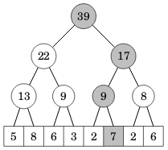
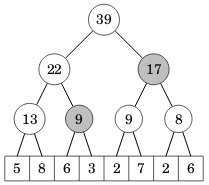
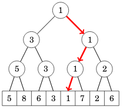
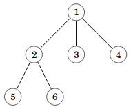
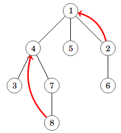
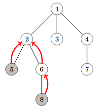
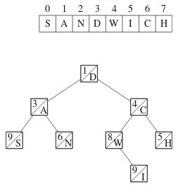
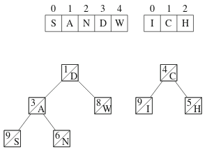
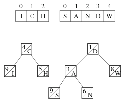

# Materiaali

## Johdanto

Tervetuloa kurssille _Algoritmit ongelmanratkaisussa_! Tämän materiaalin tarkoituksena on auttaa sinua kurssin suorittamisessa.

Materiaali olettaa, että osaat hyvin kurssin _Tietorakenteet ja algoritmit_ asiat. Voit tarvittaessa käyttää [Tirakirjaa](https://www.cs.helsinki.fi/u/ahslaaks/tirakirja/) näiden asioiden kertaamiseen. Lisäksi materiaali olettaa, että osaat C++-kielen perusteet. Jos et ole käyttänyt ennen C++-kieltä, voit opetella perusteet esimerkiksi [Tie koodariksi -kurssilta](https://tie.koodariksi.fi/cpp/).

Voit käyttää kurssilla halutessasi C++:n sijasta myös Haskell- tai Rust-kieliä, jos olet valmis opettelemaan näihin kieliin liittyviä asioita itsenäisesti. Tämä materiaali on tehty olettaen, että käytössä on C++.

**Varoitus: Monet kurssin tehtävistä ovat vaikeita, ja kurssin suorittaminen vaatii paljon työtä ja aikaa.**

## Aloittaminen

Tarvitset kurssilla tekstieditorin, jolla voi kirjoittaa koodia, sekä C++-kääntäjän. Suositeltava kääntäjä on `g++`, joka on käytössä myös CSES-järjestelmässä, johon kurssin tehtävät palautetaan.

Tässä on esimerkkinä C++-ohjelma, joka tulostaa rivin tekstiä:

```cpp
#include <iostream>

using namespace std;

int main() {
    cout << "aybabtu\n";
}
```

Seuraavat komennot kääntävät ja suorittavat ohjelman Linux-ympäristössä:

```
$ g++ test.cpp -o test -O2 -Wall
$ ./test
aybabtu
```

Tässä ohjelman koodi on tiedostossa `test.cpp` ja siitä käännetään binääritiedosto `test`. Komennon lopussa `-O2` on tavallinen koodin optimointitaso ja `-Wall` ilmaisee, että kääntäjä näyttää kaikki varoitukset.

## Syöte ja tuloste

Hyvä tapa lukea syötettä on käyttää `cin`-virtaa. Oletetaan esimerkiksi, että ohjelman tulee lukea ensimmäiseltä riviltä kaksi kokonaislukua `n` ja `k` ja sitten toiselta riviltä `n` kokonaislukua. Tämän voi toteuttaa seuraavasti:

```cpp
int n, k;
cin >> n >> k;
for (int i = 1; i <= n; i++) {
    int x;
    cin >> x;
}
```

Huomaa, että luettavien alkioiden välillä voi olla vapaasti tyhjää tilaa (kuten välilyöntejä ja rivinvaihtoja). Tämän ansiosta sama koodi toimii riippumatta siitä, miten tiedot on jaettu riveille.

Vastaavasti tietoa voidaan tulostaa `cout`-virtaan näin:

```cpp
cout << "aybabtu\n";
int a = 1, b = 2;
cout << a << " " << b << " " << a+b << "\n";
```

Koodin tulostus on seuraava:

```
aybabtu
1 2 3
```

### Tehtävät

* [Weird Algorithm](https://cses.fi/alon/task/1068)
* [Increasing Array](https://cses.fi/alon/task/1094)
* [Two Sets](https://cses.fi/alon/task/1092)
* [Collecting Numbers](https://cses.fi/alon/task/2216)

## Vektori ja järjestäminen

C++:n standardikirjasto sisältää monia valmiita tietorakenteita ja algoritmeja. Näistä usein tarvittavia ovat `vector` (muuttuvan kokoinen taulukko) sekä `sort` (tehokas järjestäminen).

### Vektorin luominen

Vektorin käyttäminen vaatii, että koodin alussa on rivi `#include <vector>`. Esimerkiksi seuraava koodi luo vektorin `c`, jonka alkiot ovat `int`-lukuja, ja lisää siihen kolme alkiota:

```cpp
vector<int> v;
v.push_back(1);
v.push_back(2);
v.push_back(3);
```

Vektorin voi myös luoda antamalla suoraan sen sisällön:

```cpp
vector<int> v = {1,2,3};
```

Funktio `size` kertoo, montako alkiota vektorissa on:

```cpp
cout << v.size() << "\n"; // 3
```

Vektorin sisältöä voi käsitellä samalla syntaksilla kuin taulukkoa. Esimerkiksi seuraava koodi muuttaa vektorin ensimmäistä alkiota:

```cpp
vector<int> v = {1,2,3};
cout << v[0] << "\n"; // 1
v[0] = 5;
cout << v[0] << "\n"; // 5
```

### Vektorin läpikäynti

Vektorin alkiot voi tulostaa for-silmukalla näin:

```cpp
vector<int> v = {1,2,3};
for (int i = 0; i < v.size(); i++) {
    cout << v[i] << " ";
}
cout << "\n";
```

Vastaavan koodin voi toteuttaa myös näin lyhyemmin:

```cpp
vector<int> v = {1,2,3};
for (auto x : v) {
    cout << x << " ";
}
cout << "\n";
```

### Järjestäminen

Järjestämisen käyttäminen vaatii, että koodin alussa on rivi `#include <algorithm>`. Seuraava koodi luo vektorin ja järjestää sitten sen sisällön:

```cpp
vector<int> v = {4,2,5,1,3};
sort(v.begin(), v.end());
// v = {1,2,3,4,5}
```

Tässä `begin` ja `end` viittaavat vektorin alkuun ja loppuun. Järjestyksen saa käänteiseksi näin:

```cpp
vector<int> v = {4,2,5,1,3};
sort(v.rbegin(), v.rend());
```

Funktiota `sort` voi käyttää muissakin yhteyksissä. Esimerkiksi merkkijonon voi järjestää näin:

```cpp
string s = "apina";
sort(s.begin(), s.end());
```

### Parit

Parin avulla voi tallentaa kaksi tietoa yhtenä alkiona. Esimerkiksi seuraava koodi luo vektorin, jossa on pareja:

```cpp
vector<pair<int,string>> v;
v.push_back({1,"apina"});
v.push_back({2,"banaani"});
v.push_back({3,"cembalo"});
```

Tässä tapauksessa parin ensimmäinen jäsen on `int`-luku ja toinen jäsen on merkkijono. Parin jäseniä voi käsitellä kenttien `first` ja `second` avulla:

```cpp
cout << v[0].first << "\n"; // 1
cout << v[0].second << "\n"; // apina
```

Kun vektorissa on pareja, ne järjestyvät ensisijaisesti ensimmäisen jäsenen mukaan ja toissijaisesti toisen jäsenen mukaan. Seuraava esimerkki esittelee tätä:

```cpp
vector<pair<int,int>> v;
v.push_back({3,5});
v.push_back({2,8});
v.push_back({3,2});
sort(v.begin(), v.end());
cout << v[0].first << " " << v[0].second << "\n"; // 2 8
cout << v[1].first << " " << v[1].second << "\n"; // 3 2
cout << v[2].first << " " << v[2].second << "\n"; // 3 5
```

### Kopioiminen

Tärkeä ero C++:n ja monen muun kielen välillä on, että C++:ssa sijoitus kopioi tietorakenteen sisällön, kun taas muissa kielissä kopioidaan vain viite. Seuraava koodi esittelee tätä:

```cpp
vector<int> a, b;
a.push_back(1);
a.push_back(2);
a.push_back(3);
b = a;
b[0] = 5;
cout << a[0] << "\n"; // 1
```

Koska sijoitus kopioi sisällön, vektorin `b` ensimmäisen alkion muuttaminen ei vaikuta vektoriin `a` vaan tietorakenteet ovat erilliset.

### Tehtävät

* [Movie Festival](https://cses.fi/alon/task/1629)
* [Missing Coin Sum](https://cses.fi/alon/task/2183)
* [Josephus Problem I](https://cses.fi/alon/task/2162)

## Lisää tietorakenteita

C++:n standardikirjasto sisältää valmiita toteutuksia tutuista tietorakenteista, samaan tapaan kuin muissa kielissä. Saatavilla on joukkoja ja hakemistoja, jotka perustuvat puu- ja hajautusrakenteisiin.

### Joukko

C++:n `set`-rakenne perustuu tasapainoiseen binäärihakupuuhun, ja sen operaatiot toimivat `O(log n)`-ajassa. Joukon käyttäminen vaatii, että koodin alussa on rivi `#include <set>`.

Seuraava koodi luo joukon, lisää siihen luvut 3, 7 ja 5 funktiolla `insert` ja hakee sitten alkioiden määrän funktiolla `size`.

```cpp
set<int> s;
s.insert(3);
s.insert(7);
s.insert(5);
cout << s.size() << "\n"; // 3
```

Funktio `count` kertoo, onko joukossa tiettyä alkiota. Koska tietty alkio voi esiintyä vain kerran joukossa, funktio palauttaa aina 0 tai 1.

```cpp
cout << s.count(5) << "\n"; // 1
cout << s.count(6) << "\n"; // 0
```

Funktio `erase` poistaa alkion joukosta:

```cpp
s.insert(4);
cout << s.count(4) << "\n"; // 1
s.erase(4);
cout << s.count(4) << "\n"; // 0
```

### Hakemisto

Hakemisto on taulukon yleistys, joka sisältää joukon avain-arvo-pareja. C++:n `map`-rakenne perustuu tasapainoiseen binäärihakupuuhun, ja sen operaatiot toimivat `O(log n)`-ajassa. Hakemiston käyttäminen vaatii, että koodin alussa on rivi `#include <map>`.

Esimerkiksi seuraava koodi luo hakemiston, jossa avaimet ovat merkkijonoja ja arvot ovat kokonaislukuja:

```cpp
map<string,int> x;
x["apina"] = 1;
x["banaani"] = 2;
x["cembalo"] = 3;
cout << x["banaani"] << "\n"; // 2
```

Jos haettua avainta ei ole hakemistossa, sen oletusarvona on 0 tai tyhjä:

```cpp
map<string,int> x;
cout << x["aybabtu"] << "\n"; // 0
```

Huomaa, että yllä oleva koodi myös lisää avaimen hakemistoon oletusarvolla.

### Prioriteettijono

Prioriteettijonoon voi lisätä alkioita sekä hakea ja poistaa pienimmän tai suurimman alkion. C++:n `priority_queue` rakenne toteuttaa prioriteettijonon, jossa voi oletuksena hakea ja poistaa suurimman alkion. Prioriteettijonon käyttäminen vaatii, että koodin alussa on rivi `#include <queue>`.

Seuraava koodi esittelee prioriteettijonon operaatioita:

```cpp
priority_queue<int> q;
q.push(3);
q.push(7);
q.push(5);
cout << q.top() << "\n"; // 7
q.pop();
cout << q.top() << "\n"; // 5
```

Huomaa, että C++:n prioriteettijono antaa oletuksena suurimman alkion, toisin kuin joissain kielissä.

### Iteraattorit

Iteraattori on muuttuja, joka osoittaa tietorakenteen alkioon. Iteraattori `begin` osoittaa ensimmäiseen alkioon ja iteraattori `end` osoittaa viimeisen alkion _jälkeiseen_ alkioon. Iteraattorin osoittamaan alkioon pääsee käsiksi `*`-merkinnällä, ja iteraattoria pystyy siirtämään operaatioilla `++` ja `--`.

Esimerkiksi seuraava koodi tulostaa kaikki joukon alkiot iteraattorin avulla. Koska joukko säilyttää järjestyksen, alkiot käydään läpi pienimmästä suurimpaan.

```cpp
set<int> s = {2,3,5,7};
auto it = s.begin();
while (it != s.end()) {
    cout << *it << "\n";
    it++;
}
```

Tämä koodi tulostaa joukon pienimmän ja suurimman alkion:

```cpp
set<int> s = {2,3,5,7};
auto it1 = s.begin();
auto it2 = s.end(); it2--;
cout << *it1 << " " << *it2 << "\n"; // 2 7
```

Funktio `find` antaa iteraattorin tiettyyn alkioon. Funktio `lower_bound` antaa iteraattorin pienimpään alkioon, joka on ainakin yhtä suuri kuin annettu alkio. Funktio `upper_bound` antaa iteraattorin pienimpään alkioon, joka on suurempi kuin annettu alkio. Jos alkiota ei ole olemassa, nämä funktiot antavat tuloksena iteraattorin `end`.

Seuraava koodi etsii iteraattoriin alkioon 5:

```cpp
auto it = s.find(5);
if (it == s.end()) {
    // alkiota ei löytynyt
}
```

Seuraava koodi tulostaa pienimmän alkion, joka on ainakin yhtä suuri kuin 5, sekä pienimmän alkion, joka on suurempi kuin 5:

```cpp
set<int> s = {2,3,5,7};
cout << *s.lower_bound(5) << "\n"; // 5
cout << *s.upper_bound(5) << "\n"; // 7
```

### Toistot joukossa

Joukkoon `set` ei voi lisätä samaa alkiota monta kertaa:

```cpp
set<int> s;
s.insert(5);
s.insert(5);
s.insert(5);
cout << s.count(5) << "\n"; // 1
```

Tämä on kuitenkin mahdollista joukossa `multiset`, joka on muuten kuin `set`, mutta sallii toistuvat alkiot:

```cpp
multiset<int> s;
s.insert(5);
s.insert(5);
s.insert(5);
cout << s.count(5) << "\n"; // 3
```

Huomaa, että `multiset`-rakenteessa funktio `count` vie aikaa `O(log n + k)`, missä `k` on toistojen määrä.

Funktio `erase` poistaa alkion _kaikki_ esiintymät joukosta:

```cpp
multiset<int> s;
s.insert(5);
s.insert(5);
s.insert(5);
cout << s.count(5); << "\n"; // 3
s.erase(5);
cout << s.count(5); << "\n"; // 0
```

Yksittäisen esiintymän pystyy kuitenkin poistamaan näin:

```cpp
multiset<int> s;
s.insert(5);
s.insert(5);
s.insert(5);
cout << s.count(5); << "\n"; // 3
s.erase(s.find(5));
cout << s.count(5); << "\n"; // 2
```

Tällöin poistettavaksi annetaan alkion asemesta iteraattori alkioon.

### Parit joukossa

Joskus on kätevää luoda joukko, jonka alkiot ovat pareja. Esimerkiksi seuraava koodi tekee näin:

```cpp
set<pair<int,int>> s;
s.insert({3,5});
s.insert({6,1});
s.insert({3,4});
```

Tällöin parit ovat järjestyksessä joukossa ensisijaisesti ensimmäisen jäsenen ja toissijaisesti toisen jäsenen mukaan:

```cpp
auto it = s.lower_bound({4,2});
cout << it->first << " " << it->second << "\n"; // 6 1
```
### Indeksoitu joukko

Kun käytössä on g++-kääntäjä, voidaan luoda myös standardikirjastoon kuulumaton tietorakenne indeksoitu joukko:

```cpp
#include <ext/pb_ds/assoc_container.hpp>
using namespace __gnu_pbds;

typedef tree<int,null_type,less<int>,rb_tree_tag,tree_order_statistics_node_update> indexed_set;
```

Tuloksena oleva tietorakenne on kuin `set`, mutta siinä on kaksi hyödyllistä `O(log n)`-aikaista lisäfunktiota. Funktio `find_by_order` antaa iteraattorin tietyssä kohdassa järjestyksessä olevaan alkioon. Funktio `order_of_key` puolestaan kertoo, missä kohtaa järjestystä tietty joukon alkio on (tai _olisi_, jos alkiota ei ole joukossa).

```
indexed_set s;
s.insert(2);
s.insert(3);
s.insert(7);
s.insert(9);

auto x = s.find_by_order(2);
cout << *x << "\n"; // 7

cout << s.order_of_key(7) << "\n"; // 2
cout << s.order_of_key(6) << "\n"; // 2
cout << s.order_of_key(8) << "\n"; // 3
```

### Tehtävät

* [Concert Tickets](https://cses.fi/alon/task/1091)
* [Room Allocation](https://cses.fi/alon/task/1164)
* [Subarray Distinct Values](https://cses.fi/alon/task/2162)
* [Josephus Problem II](https://cses.fi/alon/task/2163)

## Dynaaminen ohjelmointi

Dynaaminen ohjelmointi on keskeinen tekniikka algoritmien suunnittelussa. Siinä on ideana muotoilla ongelman ratkaisu rekursiivisesti niin, että vastaus saadaan laskemalla ratkaisut pienempiin osaongelmiin. Dynaaminen ohjelmointi on tehokasta, kunhan erilaisten osaongelmien määrä on niin pieni, että niiden vastaukset voidaan tallentaa muistiin taulukkoon.

Jos et muista hyvin, miten dynaamista ohjelmointia käytetään, sinun kannattaa lukea [Tirakirjasta](https://www.cs.helsinki.fi/u/ahslaaks/tirakirja/) luku 9, joka käsittelee kattavasti dynaamista ohjelmointia.

### Tehtävät

* [Two Sets II](https://cses.fi/alon/task/1093)
* [Rectangle Cutting](https://cses.fi/alon/task/1744)

## X

### Pienin muutos

Annettuna on `n` lukua `a[0]`, `a[1]`, ..., `a[n-1]` ja tehtävänä on löytää luku `x`, joka minimoi summan `abs(a[0]-x)+abs(a[1]-x)+...+abs(a[n-1]-x)` (tässä `abs` tarkoittaa itseisarvoa).

Osoittautuu, että sopiva `x` on aina _mediaani_ luvuista `a[0]`, `a[1]`, ..., `a[n-1]`. Tämä johtuu siitä, että jos `x` olisi pienempi kuin mediaani, sen kasvattaminen parantaisi ratkaisua, koska etäisyys pienenisi useampaan lukuun kuin suurenisi. Samasta syystä jos `x` olisi suurempi kuin mediaani, sen vähentäminen parantaisi ratkaisua.

### Lähimmät pienimmät

Annettuna on taulukko, jossa on `n` alkiota, ja tehtävänä on selvittää jokaiseen kohtaan lähin edellinen kohta, jossa on pienempi alkio. Tehtävä olisi helppo ratkaista neliöllisessä ajassa, mutta myös lineaarinen ratkaisu on mahdollinen.

Ideana on käydä läpi taulukko vasemmalta oikealle ja pitää yllä pinoa, jossa on taulukon kohtia. Joka kohdassa pinosta poistetaan kohtia niin kauan kuin nykyisessä kohdassa oleva luku on pienempi tai yhtä suuri kuin pinon kohdassa oleva luku. Tämän jälkeen tiedetään, että lähin pienempi alkio on pinossa ylimpänä olevassa kohdassa (tai pienempää alkiota ei ole, jos pino on tyhjä). Lopuksi nykyinen kohta lisätään pinoon.

Tämä algoritmi toimii lineaarisessa ajassa, koska jokainen kohta lisätään pinoon ja poistetaan pinosta vain kerran.

### Binäärihaku

Binäärihaun avulla voidaan etsiä logaritmisessa ajassa haluttu alkio järjestetystä taulukosta. Kätevä tapa toteuttaa binäärihaku on seuraava:

```cpp
int k = 0;
for (int b = n; b >= 1; b /= 2) {
     while (k+b < n && a[k+b] <= x) k += b;
}
if (a[k] == x) // alkio x löytyi kohdasta k
```

Tämä koodi etsii lukua `x` taulukosta `a`, jossa on `n` lukua. Haku lähtee liikkeelle taulukon alusta ja joka vaiheessa hypätään eteenpäin `b` askelta, jos kohteena oleva indeksi on taulukossa ja sen kohdalla oleva arvo on enintään `x`. Koodin aikavaativuus on logaritminen, koska `b` puolittuu joka kierroksella.

Käytännössä binäärihakua ei kuitenkaan tarvitse toteuttaa yleensä alkion etsimistä varten, koska C++:n standardikirjastossa on paljon valmiita työkaluja tähän (mukaan lukien funktio `binary_search`). Binäärihaun todellinen hyöty on kuitenkin siinä, että sen avulla voidaan etsiä funktion _muutoskohta_.

Oletetaan, että funktio `f(x)` saa arvon 0, kun `x` on enintään `k`, ja arvon 1, kun `x` on yli `k`. Binäärihaun avulla voidaan löytää tehokkaasti muutoskohta `k` seuraavasti:

```cpp
int k = 0;
for (int b = n; b >= 1; b /= 2) {
    while (f(k+b) == 0) k += b;
}
```

Tässä tapauksessa `n` on sopivasti valittu riittävän suuri luku, jonka tiedetään olevan suurempi kuin muutoskohta `k`.

Muutoskohdan etsimisestä on hyötyä, koska monen ongelman voi esittää muodossa "etsi ensimmäinen kohta, jossa tapahtuu jotakin" (esimerkiksi pienin aika, jossa tehdas saa valmistettua halutun määrän tuotteita). Binäärihaun avulla riittää kokeilla vain logaritminen määrä vaihtoehtoja kyseiselle kohdalle.

### Meet in the middle

TODO

### Tehtävät

* [Stick Lengths](https://cses.fi/alon/task/1074)
* [Nearest Smaller Values](https://cses.fi/alon/task/1645)
* [Factory Machines](https://cses.fi/alon/task/1620)
* [Array Division](https://cses.fi/alon/task/1085)
* [Meet in the Middle](https://cses.fi/alon/task/1628)

## Segmenttipuu

Segmenttipuu on tietorakenne, jonka avulla voi toteuttaa tehokkaita välikyselyitä taulukkoon. Tavallisia välikyselyitä ovat välin summan laskeminen sekä välin pienimmän/suurimman alkion etsiminen.

### Esimerkki

Tarkastellaan esimerkkinä tilannetta, jossa haluamme tehdä välikyselyitä, joissa lasketaan taulukon alkioiden summa tietyllä välillä.

Segmenttipuu on mukavinta toteuttaa niin, että taulukon koko on 2:n potenssi. Taulukon loppuun voi tarvittaessa lisätä ylimääräisiä alkioita, jotta tämä toteutuu.

Seuraava segmenttipuu vastaa taulukkoa `[5,8,6,3,2,7,2,6]`:


Puun lehtinä ovat taulukon alkiot ja muilla tasoilla jokaisessa solmussa on kahden alemman tason solmun summa.

### Puun tallentaminen

Segmenttipuu tallennetaan taulukkona, jossa on `2n` alkiota, kun `n` on alkuperäisen taulukon koko. Kohdassa 1 on puun juuren alkio, kohdissa 2 ja 3 ovat seuraavan tason alkiot, jne. Alkuperäisen taulukon sisältö alkaa kohdasta `n`.

Esimerkin taulukkoa vastaa seuraava segmenttipuu:

```
int tree[] = {0,39,22,17,13,9,9,8,5,8,6,3,2,7,2,6};
```

Huomaa, että taulukon kohta 0 ei ole käytössä segmenttipuussa.

Tässä tallennustavassa kohdassa `k` olevan solmun vasen lapsi on kohdassa `2k`, oikea lapsi on kohdassa `2k+1` ja vanhempi on kohdassa `k/2` (pyöristys alaspäin kokonaisluvuksi). Tämä on sama tallennustapa kuin binäärikeossa käytetty.

### Alkion muuttaminen

Kun taulukon alkio muuttuu, tämän tulee heijastua kaikkiin puun solmuihin, jotka ovat polulla juuresta alkioon. Esimerkiksi seuraavassa kuvassa alkion 7 muuttuminen vaikuttaa kaikkiin harmaisiin solmuihin:



Seuraava koodi toteuttaa alkion muuttamisen:

```cpp
// muuta kohdan k arvoksi x
void change(int k, int x) {
    k += n;
    tree[k] = x;
    for (k /= 2; k >= 1; k /= 2) {
        tree[k] = tree[2*k]+tree[2*k+1];
    }
}
```

Koodi vie aikaa `O(log n)`, koska puussa on logaritminen määrä tasoja.

### Välikysely

Välikyselyssä väli muodostetaan mahdollisimman korkealla puussa olevista solmuista. Esimerkiksi kun haluamme laskea välin `[6,3,2,7,2,6]` summan, saamme sen kahdesta ylemmästä solmusta laskemalla `9+17=26`:



Seuraava koodi laskee summan annetun välin alkioiden summan:

```cpp
// laske välin a...b alkioiden summa
int getSum(int a, int b) {
    a += n; b += n;
    int s = 0;
    while (a <= b) {
        if (a%2 == 1) s += tree[a++];
        if (b%2 == 0) s += tree[b--];
        a /= 2; b /= 2;
    }
    return s;
}
```

Koodi käy läpi puun tasoja pohjalta alkaen ja lisää vasemman ja oikean alkion summaan, jos ylemmän tason solmu on välin ulkopuolella. Koodi vie aikaa `O(log n)`, koska tasojen määrä on logaritminen.

### Muut kyselyt

Segmenttipuun avulla voi toteuttaa tehokkaasti minkä tahansa kyselyn, jossa kyselyn vastauksen voi laskea jakamalla välin kahteen osaan ja yhdistämällä kummankin osan kyselyjen vastaukset.

Esimerkiksi seuraavan segmenttipuun avulla voi etsiä välin pienimmän alkion. Ideana on, että jokaisessa solmussa on minimi sen kahden lapsen arvoista.


Tällaista puuta voi käsitellä näillä funktioilla:

```cpp
// muuta kohdan k arvoksi x
void change(int k, int x) {
    k += n;
    tree[k] = x;
    for (k /= 2; k >= 1; k /= 2) {
        tree[k] = min(tree[2*k], tree[2*k+1]);
    }
}

// etsi välin a...b pienin alkio
int getMin(int a, int b) {
    a += n; b += n;
    int x = tree[a];
    while (a <= b) {
        if (a%2 == 1) x = min(x, tree[a++]);
        if (b%2 == 0) x = min(x, tree[b--]);
        a /= 2; b /= 2;
    }
    return x;
}
```

### Binäärihaku puussa

Segmenttipuuta voi myös käsitellä binäärihaun tyylisesti aloittamalla haku puun juuresta ja liikkumalla joka askeleella alaspäin vasemmalle tai oikealle.

Seuraava kuva näyttää esimerkin, kuinka äskeisestä puusta voi löytää tehokkaasti pienimmän alkion:



Vastaavalla tavalla voi esimerkiksi ylläpitää taulukkoa, jossa jokainen arvo on bitti 0 tai 1, ja etsiä summien avulla, missä on `k`:nnes bitti 1.

### Tehtävät

* [Dynamic Range Sum Queries](https://cses.fi/alon/task/1648)
* [Dynamic Range Minimum Queries](https://cses.fi/alon/task/1649)
* [Hotel Queries](https://cses.fi/alon/task/1143)
* [List Removals](https://cses.fi/alon/task/1749)
* [Increasing Subsequence](https://cses.fi/alon/task/1145)
* [Range Update Queries](https://cses.fi/alon/task/1651)
* [Nested Ranges Count](https://cses.fi/alon/task/2169)
* [Distinct Values Queries](https://cses.fi/alon/task/1734)

## Verkkoalgoritmit

### Tehtävät

* [Building Roads](https://cses.fi/alon/task/1666)
* [Flight Discount](https://cses.fi/alon/task/1195)
* [Investigation](https://cses.fi/alon/task/1202)
* [Mail Delivery](https://cses.fi/alon/task/1691)
* [Planets Queries I](https://cses.fi/alon/task/1750)
* [Planets Queries II](https://cses.fi/alon/task/1160)
* [Reachable Nodes](https://cses.fi/alon/task/2138)
* [Necessary Roads](https://cses.fi/alon/task/2076)
* [Necessary Cities](https://cses.fi/alon/task/2077)

## Puualgoritmit

Puu on yhtenäinen ja syklitön verkko, jossa on `n` solmua ja `n-1` kaarta. Puussa jokaisen kahden solmun välillä on yksikäsitteinen polku.

### Esimerkki

Tässä on esimerkkinä puu, jossa on 6 solmua ja 5 kaarta:


Yleensä hyvä tapa tallentaa puu on vieruslistaesitys luomalla taulukko, jossa on vektoreita. Esimerkiksi voimme tallentaa yllä olevan puun näin:

```cpp
vector<int> tree[7];
tree[1].push_back(2);
tree[1].push_back(3);
tree[1].push_back(4);
tree[2].push_back(1);
tree[2].push_back(5);
tree[2].push_back(6);
tree[3].push_back(1);
tree[4].push_back(1);
tree[5].push_back(2);
tree[6].push_back(2);
```

### Juurtaminen

Puun käsittelyä helpottaa usein, jos valitsemme yhden sen solmuista juureksi. Tyypillisesti valitsemme juureksi solmun 1.

Esimerkiksi äskeinen puumme näyttää juurrettuna tältä:



Tämän jälkeen puun solmut asettuvat tasoittain juuren alapuolelle, ja jokaisesta solmusta alkaa alipuu, jonka juurena se on.

### Läpikäynti

Voimme käydä läpi kaikki puun solmut juuresta alkaen syvyyshaulla. Esimerkiksi seuraava funktio tulostaa kaikki puun solmut:

```cpp
void dfs(int node, int prev) {
    cout << node << "\n";
    for (auto next : tree[node]) {
        if (next == prev) continue;
        dfs(next, node);
    }
}
```

Tulostaminen alkaa kutsumalla funktiota `dfs(1,0)`. Parametri `node` on nykyinen solmu ja parametri `prev` on edellinen solmu. Läpikäynti etenee kaikkiin solmuihin edellistä solmua lukuun ottamatta. Tässä tapauksessa solmut tulostetaan järjestyksessä 1, 2, 5, 6, 3, 4.

### Dynaaminen ohjelmointi

Voimme laskea läpikäynnin yhteydessä puun solmuihin tietoa dynaamisella ohjelmoinnilla. Esimerkiksi seuraava koodi luo taulukon `count`, joka kertoo jokaiselle solmulle, montako solmua sen alipuussa on:

```cpp
void dfs(int node, int prev) {
    count[node] = 1;
    for (auto next : tree[node]) {
        if (next == prev) continue;
        dfs(next, node);
        count[node] += count[next];
    }
}
```

Seuraava koodi puolestaan laskee jokaisesta solmusta taulukkoon `length`, kuinka pitkä on pisin solmusta alaspäin lähtevä polku:

```cpp
void dfs(int node, int prev) {
    length[node] = 0;
    for (auto next : tree[node]) {
        if (next == prev) continue;
        dfs(next, node);
        length[node] = max(length[node], length[next]+1);
    }
}
```

Dynaamisen ohjelmoinnin avulla voidaan laskea tehokkaasti esimerkiksi puun _läpimitta_ eli suurin etäisyys kahden solmun välillä tai yleisemmin jokaiseen solmuun suurin etäisyys toiseen solmuun. Tällaisissa tehtävissä voi auttaa laskea jokaiseen solmuun useita etäisyyksiä, kuten kuinka pitkiä ovat kaksi pisintä polkua solmusta alaspäin kahteen eri suuntaan.

### Esivanhemman etsiminen

Tavallinen kysely puussa on selvittää solmun esivanhempi, johon pääsee kulkemalla tasoja ylöspäin puussa. Merkitään `f(x,k)` solmun `x` esivanhempaa `k` tasoa ylempänä. Esimerkiksi seuraavassa kuvassa `f(2,1)=1` ja `f(8,2)=4`.



Voimme vastata tällaisiin kyselyihin tehokkaasti `O(log n)`-ajassa hyppytaulukon avulla. Esikäsittely vie aikaa `O(n log n)`.

### Alin yhteinen esivanhempi

Solmujen `a` ja `b` alin yhteinen esivanhempi on alin puun solmu, joka on kummankin solmun esivanhempi. Esimerkiksi seuraavassa kuvassa solmujen 5 ja 8 alin yhteinen esivanhempi on solmu 2.



Pystymme selvittämään alimman yhteisen esivanhemman tehokkaasti kahdessa vaiheessa. Ensin nostamme alemman tason solmua ylöspäin niin, että molemmat solmut ovat samalla tasolla. Tämän jälkeen nostamme solmuja yhtä aikaa ylöspäin, kunnes ne törmäävät. Molemmat vaiheet onnistuvat ajassa `O(log n)` hyppytaulukon avulla.

### Etäisyydet puussa

Kun meillä on keino selvittää tehokkaasti kahden solmun alin yhteinen esivanhempi, voimme myös laskea tehokkaasti kahden solmun etäisyyden eli niiden välillä olevan polun pituuden.

Oletetaan, että solmut ovat `a` ja `b` ja niiden alin yhteinen esivanhempi on `c`. Merkitään lisäksi `d(x)` solmun `x` syvyyttä. Voimme laskea näiden tietojen perusteella solmujen `a` ja `b` etäisyyden kaavalla `d(a)+d(b)-2*d(c)`.

### Keskussolmut

TODO

### Tehtävät

* [Tree Diameter](https://cses.fi/alon/task/1131)
* [Tree Distances I](https://cses.fi/alon/task/1132)
* [Tree Distances II](https://cses.fi/alon/task/1133)
* [Company Queries I](https://cses.fi/alon/task/1687)
* [Company Queries II](https://cses.fi/alon/task/1688)
* [Distance Queries](https://cses.fi/alon/task/1135)
* [Finding a Centroid](https://cses.fi/alon/task/2079)

## Matematiikka

### Tehtävät

* [Counting Divisors](https://cses.fi/alon/task/1713)
* [Common Divisors](https://cses.fi/alon/task/1081)
* [Binomial Coefficients](https://cses.fi/alon/task/1079)
* [Distributing Apples](https://cses.fi/alon/task/1716)
* [Nim Game I](https://cses.fi/alon/task/1730)
* [Nim Game II](https://cses.fi/alon/task/1098)
* [Stair Game](https://cses.fi/alon/task/1099)

## Merkkijonot

### Tehtävät

* [String Matching](https://cses.fi/alon/task/1753)
* [Finding Borders](https://cses.fi/alon/task/1732)
* [Minimal Rotation](https://cses.fi/alon/task/1110)
* [Counting Patterns](https://cses.fi/alon/task/2103)
* [Pattern Positions](https://cses.fi/alon/task/2104)
* [Distinct Substrings](https://cses.fi/alon/task/2105)
* [Substring Distribution](https://cses.fi/alon/task/2110)

## Treap-rakenne

Treap on binääripuu, jonka avulla voi toteuttaa merkkijonon tai taulukon, jonka osia pystyy siirtelemään tehokkaasti. Jokaisessa puun solmussa on kaksi arvoa: paino ja sisältö. Jokaisen solmu paino on satunnainen ja sisältö kuvaa taulukon alkiota. Ehtona on, että jokaisessa kohdassa solmu on painavampi tai yhtä painava kuin sen vanhempi.

Treapin sisällön voi tulkita niin, että jokaisessa solmussa vasemman alipuun solmut ovat järjestyksessä ennen solmua ja oikean alipuun solmut ovat järjestyksessä solmun jälkeen. Tällä tavalla voimme tallentaa merkkijonon tai taulukon sisällön treapiin.

Seuraavassa on esimerkkinä treap, joka vastaa merkkijonoa SANDWICH:



### Operaatiot

Treapin ensimmäinen operaatio on _jakaminen_. Tämä toteutetaan lähtemällä liikkeelle puun juuresta ja siirtämällä puun osia vasempaan ja oikeaan puuhun. Seuraava kuva näyttää tuloksen, kun merkkijono SANDWICH jaetaan osiin SANDW ja ICH:



Treapin toinen operaatio on _yhdistäminen_. Tämä tarkoittaa, että kaksi treapia liitetään peräkkäin. Voimme esimerkiksi yhdistää äsken saamamme osat toisin päin, eli ensin ICH ja sitten SANDW:



Yhdistämisessä muodostamme uuden treapin, johon valitaan osia vasemmasta ja oikeasta treapista solmujen painojen perusteella. Esimerkissämme tuloksena on seuraava treap:


Treapin tehokkuus perustuu siihen, että jokaisessa solmussa on satunnainen paino. Tämän ansiosta kun jakaminen ja yhdistäminen toteutetaan painoehdon mukaisesti, operaatiot vievät aikaa vain `O(log n)`.

Treapin perustoteutukseen on mahdollista yhdistää monia lisäominaisuuksia. Esimerkiksi treapia voi laajentaa niin, että sen pystyy kääntämään tehokkaasti, lisäämällä joka solmuun kentän, joka kertoo, onko vastaava alipuu käännetty. Lisäksi solmuihin voi toteuttaa kaikenlaista laskentaa segmenttipuun tapaisesti.

### Toteutus

Kuinka treap kannattaisi sitten toteuttaa? Tämä on melko mutkikasta, mutta seuraava koodi antaa hyvän pohjan:

```cpp
#include <iostream>

using namespace std;

struct node {
    node *left, *right;
    int weight, size, value;
    node (int v) {
        left = right = NULL;
        weight = rand();
        size = 1;
        value = v;
    }
};

int size(node *treap) {
    if (treap == NULL) return 0;
    return treap->size;
}

void split(node *treap, node *&left, node *&right, int k) {
    if (treap == NULL) {
        left = right = NULL;
    } else {
        if (size(treap->left) < k) {
            split(treap->right, treap->right, right, k-size(treap->left)-1);
            left = treap;
        } else {
            split(treap->left, left, treap->left, k);
            right = treap;
        }
        treap->size = size(treap->left)+size(treap->right)+1;
    }
}

void merge(node *&treap, node *left, node *right) {
    if (left == NULL) treap = right;
    else if (right == NULL) treap = left;
    else {
        if (left->weight < right->weight) {
            merge(left->right, left->right, right);
            treap = left;
        } else {
            merge(right->left, left, right->left);
            treap = right;
        }
        treap->size = size(treap->left)+size(treap->right)+1;
    }
}

void print(node *treap) {
    if (treap == NULL) return;
    print(treap->left);
    cout << treap->value << " ";
    print(treap->right);
}

int main() {
    // luo treap taulukolle [1,2,3,4,5,6,7,8]
    node *treap = NULL;
    merge(treap,treap,new node(1));
    merge(treap,treap,new node(2));
    merge(treap,treap,new node(3));
    merge(treap,treap,new node(4));
    merge(treap,treap,new node(5));
    merge(treap,treap,new node(6));
    merge(treap,treap,new node(7));
    merge(treap,treap,new node(8));
    print(treap);
    cout << "\n";
    // jaa taulukko osiin [1,2,3,4] ja [5,6,7,8] ja yhdistä ne uudestaan taulukoksi [5,6,7,8,1,2,3,4]
    node *left, *right;
    split(treap,left,right,4);
    merge(treap,right,left);
    print(treap);
    cout << "\n";
}
```

### Tehtävät

* [Cut and Paste](https://cses.fi/alon/task/2072)
* [Substring Reversals](https://cses.fi/alon/task/2073)
